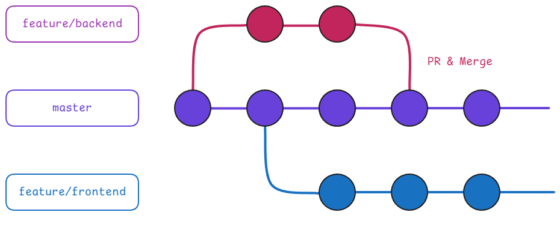

# 버전 관리

## 프로젝트 구조
```
📂root
├── 📂frontend
│   ├── Dockerfile
│   ├── nginx.conf
│   ├── 📂public
│   │   ├── index.html
│   │   └── favicon.ico
│   ├── 📂src
│   │   ├── App.tsx
│   │   ├── index.tsx
│   │   └── 📂components
│   │       └── ExampleComponent.tsx
│   ├── package.json
│   ├── tsconfig.json
│   ├── .env
│   └── .gitignore
├── 📂backend
│   ├── gunicorn.conf.py
│   ├── 📂app
│   │   ├── 📂api
│   │   ├── 📂tests
│   │   └── main.py
│   ├── 📂crawler
│   ├── 📂libs
│   └── .gitignore
├── docker-compose.yml
├── .env
└── README.md
```

프론트, 백엔드 프로젝트가 통합된 `MonoRepo` 구조. 
- `root/frontend/*`: 웹 서버(Nginx) 및 프론트엔드(React.js) 관련 파일
- `root/backend/*`: API 서버 및 크롤러 관련 파일

## 브랜치 전략



변형된 [GitHub Flow](https://docs.github.com/ko/get-started/using-github/github-flow)를 따른다.
- `main`: 모든 작업이 병합되고 최종적으로 배포되는 브랜치.
- `feature/*`: 새로운 기능이나 버그 수정을 위한 브랜치. PR을 통해 `main`에 병합.
  - `feature/frontend/*`: 프론트엔드 관련 작업만 가능. `frontend` 이외의 디렉토리 수정시 병합 불가
  - `feature/backend/*`: 백엔드 관련 작업만 가능. `backend` 이외의 디렉토리 수정시 병합 불가

## 커밋 메세지 컨벤션
**편의상 본문은 생략하고 제목만 작성합니다.**
```bash
git commit -m "<커밋 타입>: <변경 내용에 대한 간결한 설명>"
```
### 커밋 타입
- `feat`: 새로운 기능 추가
- `fix`: 버그 또는 오류 수정
- `chore`: 빌드나 설정, 그 외 작업
- `refactor`: 코드 리팩토링(기능 변화 X)
- `perf`: 성능 최적화 작업(기능 변화 X)

### 예시
```
feat: 채팅 입력 컴포넌트 추가
```
```
fix: CORS 오류 해결
```
```
chore: nginx 설정 파일 수정
```
```
refactor: 컴포넌트에서 API 호출 로직 분리
```
```
perf: API 다중 호출 병렬 처리로 대기시간 단축
```

## Pull Request 컨벤션

- 제목은 PR 내용에 대한 간략한 정보 요약하여 작성.
- 본문은 PR 템플릿을 참고하여 작성.
