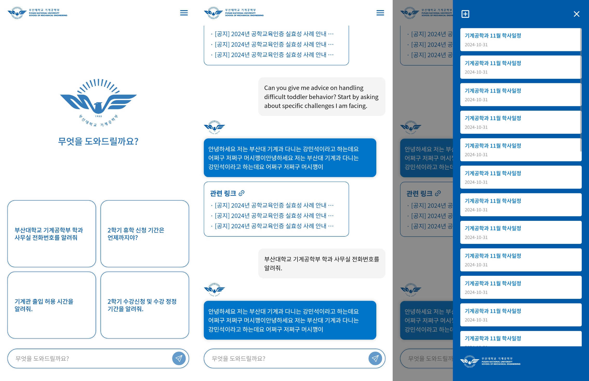
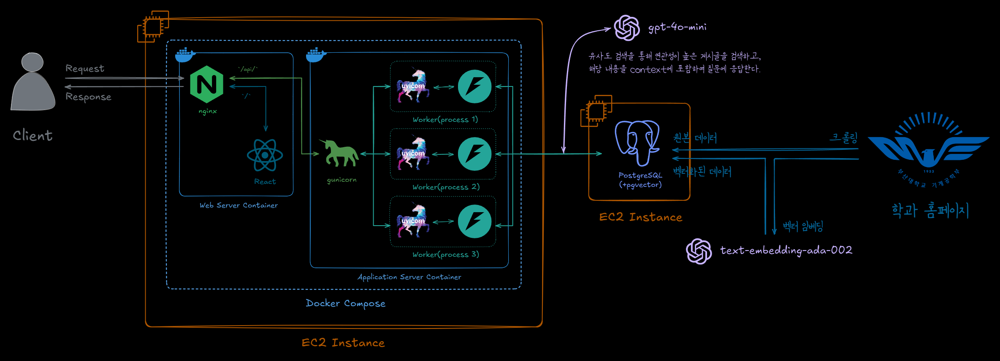

# ME 챗봇 프로젝트

## 기술 스택

- Frontend: React.js(TS), Zustand, TailwindCSS
- Backend: FastAPI, Celery, Redis
- DB: PostgreSQL(+pgvector)
- 텍스트 임베딩: [bge-m3](https://huggingface.co/BAAI/bge-m3), [Huggingface TEI](https://github.com/huggingface/text-embeddings-inference)
- 대화 생성: [gpt-4o-mini](https://platform.openai.com/docs/models/gpt-4o-mini)

## 서버 구조도

## 멤버

- [박준혁](https://github.com/JakeFRCSE)
- [강민석](https://github.com/myeolinmalchi)
- [박상훈](https://github.com/sanghunii)

## 버전 관리

[CONTRIBUTING.md](./CONTRIBUTING.md)
